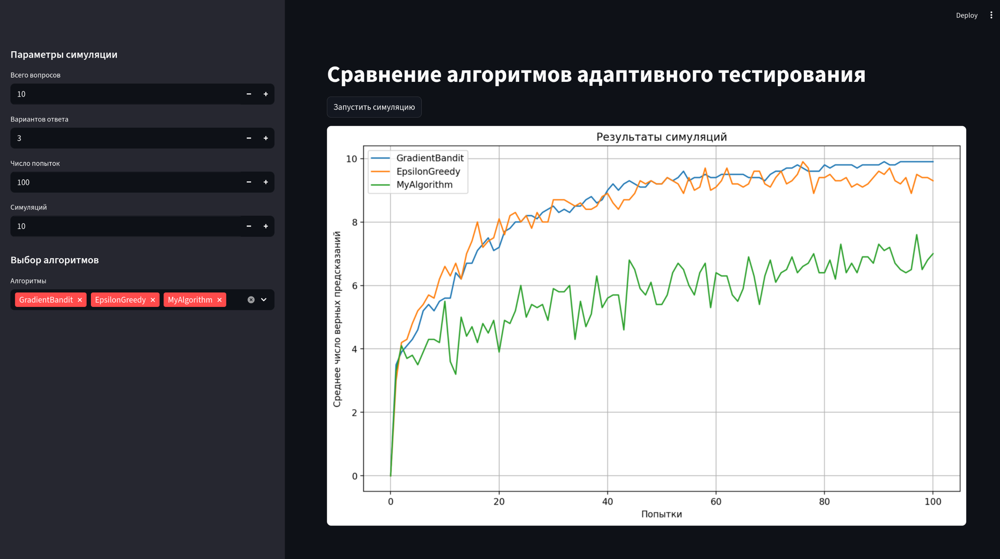

# Quiz Solver Problem

## Описание задачи

Рассматривается тест из `N` вопросов, в каждом из которых есть `K` вариантов ответа.  
Система после каждой попытки сообщает только суммарный результат (количество правильных ответов),  
не указывая, какие именно ответы оказались верными.  

Задача: на основе такой ограниченной обратной связи восстановить правильные ответы, используя как можно меньше попыток.

## Структура проекта

- `my_solution.py` — файл, в который участники пишут собственный алгоритм (`MyAlgorithm`).  
  Алгоритм должен реализовывать методы:
  - `predict(q)` → вернуть индекс предполагаемого ответа для вопроса `q`;
  - `update(chosen_questions, user_attempts, normalized_score, probs_all)` → обновить внутреннее состояние по результатам попытки;
  - `predict_proba(q)` → вернуть вероятностное распределение по вариантам.

- `main.py` — Запускает проверку алгоритма и фиксирует номер попытки, на которой достигается целевая точность 90%.

- `algorithms/` — набор базовых реализаций (градиентный бандит, epsilon-greedy, байесовский алгоритм, EM и др.).

- `simulator/` — служебные модули для генерации данных, пользователей и проведения симуляций.

- `streamlit_app.py` — интерактивное приложение на Streamlit для визуального сравнения алгоритмов. Позволяет запускать эксперименты и строить графики.

## Запуск симуляции в консоли

Простейший запуск:
```bash
python main.py
````

Доступные аргументы:

```bash
python main.py \
    --n_questions 10 \
    --n_variants 3 \
    --max_attempts 100 \
    --threshold 0.90 \
    --seed 123 \
    --debug \
    --random_user
````

Описание аргументов:

* `--n_questions` — количество вопросов;
* `--n_variants` — количество вариантов ответа;
* `--max_attempts` — максимальное число попыток;
* `--threshold` — целевая точность (например, `0.95` для 95%);
* `--seed` — сид генератора случайных чисел;
* `--debug` — режим подробного вывода хода симуляции;
* `--random_user` — пользователь всегда отвечает случайно, независимо от доверия к алгоритму (полезно для проверки устойчивости метода).

## Запуск Streamlit-приложения

Для запуска веб-интерфейса:

```bash
streamlit run streamlit_app.py
```

[](screenshot.png)

Функциональность:

* выбор и добавление алгоритмов для сравнения,
* проведение параллельных симуляций,
* визуализация динамики точности,
* сравнение стратегий на графиках.

## Как участвовать

1. Реализуйте класс `MyAlgorithm` в файле `mysolve.py`.
2. Запустите консольную симуляцию (`python main.py`) и проверьте, на какой попытке алгоритм достигает заданного порога точности.
3. Используйте Streamlit-приложение для анализа и сравнения алгоритмов.

<details>
<summary> Страшные подробности </summary>

## Как работает симуляция (пошагово)

1. **Инициализация**

* Генерируется скрытый вектор правильных ответов `correct_answers` длины `N` с числами от `0` до `K-1`.
* Создаются экземпляры `MyAlgorithm(n_total_questions=N, n_variants=K)` и `User(n_variants=K, always_random=--random_user)`.
* Фиксируются сиды `random` и `numpy` для воспроизводимости.

2. **Цикл попыток** (для `attempt = 1 .. max_attempts`)

* Вычисляется доверие пользователя `trust = (attempt / max_attempts)^2`. Если передан флаг `--random_user`, доверие игнорируется.
* Для **каждого вопроса `q`**:

  * Симуляция запрашивает у алгоритма распределение вероятностей по вариантам:

    * если реализован `predict_proba(q)` — используется он;
    * иначе берётся «острый» вектор на основе `predict(q)` (единица на выбранном варианте).
  * Пользователь выбирает ответ:

    * если `--random_user` включён — равномерно случайно из `0..K-1`;
    * иначе с вероятностью `1 - trust` — случайно, с вероятностью `trust` — по `probs_system`.
  * Параллельно фиксируется «жёсткое» предсказание алгоритма `predictions[q] = algo.predict(q)`.
  * Сохраняются `user_attempts[q]` и `probs_all[q]` (это нужно для обучения).

3. **Подсчёт двух метрик**

* **Что видел бы реальный тест (для обучения):**
  `score_user = mean(user_attempts[q] == correct_answers[q])`.
* **Какой на самом деле уровень алгоритма (для оценки):**
  `score_algo = mean(predictions[q] == correct_answers[q])`.

4. **Обновление алгоритма**

* Вызывается `algo.update(chosen_questions, user_attempts, score_user, probs_all)`, где

  * `chosen_questions = list(range(N))` (в этой версии берём все вопросы),
  * `user_attempts` — ответы пользователя,
  * `score_user` — агрегированная обратная связь (аналог «балла от системы»),
  * `probs_all` — распределения, которые алгоритм показывал (по одному на вопрос).
* Важно: алгоритм **не видит** `correct_answers` и **не знает**, где были ошибки; он учится **только** на суммарном `score_user` и собственных распределениях `probs_all`.

5. **Контроль останова**

* Если `score_algo >= threshold` — симуляция завершает работу и печатает номер попытки, на которой алгоритм достиг целевой точности.
* Если цикл закончился без достижения порога — печатается соответствующее сообщение.

6. **Режим отладки (`--debug`)**

* Каждые 10 попыток (и при достижении порога) выводятся:

  * номер попытки и текущее `trust`,
  * `user_score` (по пользовательским ответам) и `algo_score` (по предсказаниям),
  * для проверки — предсказание `Q0_pred` и истинный ответ `Q0_true` по первому вопросу.

## Контракт для `MyAlgorithm`

Минимально необходимо:

* `predict(q: int) -> int` — вернуть индекс варианта `0..K-1`.
* `update(chosen_questions: list[int], user_attempts: list[int], normalized_score: float, probs_all: list[np.ndarray]) -> None` — обновить внутреннее состояние.
* `predict_proba(q: int) -> np.ndarray` длины `K` с суммой 1. Если метода нет, симуляция заменит его «острым» вектором по `predict(q)`.

Замечания:

* Все индексы вариантов — от `0` до `K-1`.
* `normalized_score` — число в диапазоне `[0,1]`.
* Если используете вероятности, нормируйте так, чтобы `sum(probs) == 1` и не было отрицательных значений.

## Что меняет `--random_user`

* Пользователь **всегда** отвечает равномерно случайно, независимо от рекомендаций алгоритма.
* Это стресс-тест: алгоритм не получает «подыгрывания» от пользователя и видит более шумный `score_user`.
* Полезно для проверки устойчивости метода.
</details>